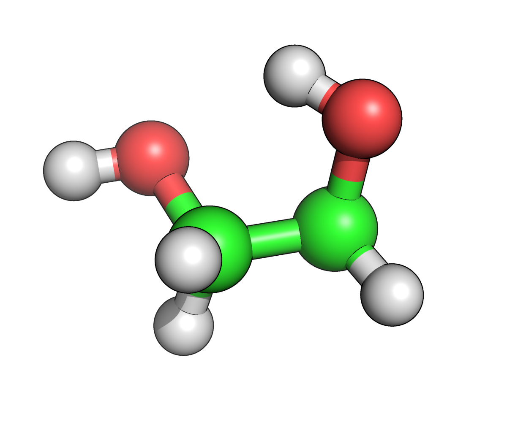

# MD simulations with OpenMM


OpenMM is a hardware independent molecular simulation library developed by Pande group at Stanford. OpenMM core libraries are written in C++ but a python wrapper is provided to make the interaction between user and library smoother. Please look at the below references for more information

-  [Instaling OpenMM](http://docs.openmm.org/7.0.0/userguide/application.html#installing-openmm)
-  [JCTC paper on implementation and capabilities](http://pubs.acs.org/doi/abs/10.1021/ct300857j) 
-  [Documentation](http://openmm.org/documentation.html) 

Please install OpenMM using from source code or using conda build if anaconda python is available in your computer. After successful installation continue to the do the tutorial below.

---
## Combination Rules 
Its important to note that most of the current force fields except OPLS-AA use Lorentz- Berthelot combination rule $$( \sigma_{ij} = \frac{\sigma_i + \sigma_j}{2} $$ and $$\epsilon_{ij} = \sqrt{\epsilon_i \epsilon_j} )$$ and is the only combination rule implemented in OpenMM. If one wishes to use geometric combination rule used in OPLS-AA force field, include the function below in your MD codes and call the function to change the combination rule for LJ interactions. 

```python
def OPLS_LJ(system):
    forces ={system.getForce(index).__class__.__name__:system.getForce(index) for index in range(system.getNumForces())}
    nonbonded_force = forces['NonbondedForce']
    lorentz = mm.CustomNonbondedForce( '4*epsilon*((sigma/r)^12-(sigma/r)^6); sigma=sqrt(sigma1*sigma2); epsilon=sqrt(epsilon1*epsilon2)')
    lorentz.setNonbondedMethod(nonbonded_force.getNonbondedMethod())
    lorentz.addPerParticleParameter('sigma')
    lorentz.addPerParticleParameter('epsilon')
    lorentz.setCutoffDistance(nonbonded_force.getCutoffDistance())
    system.addForce(lorentz)
    LJset = {}
    for index in range(nonbonded_force.getNumParticles()):
        charge, sigma, epsilon =nonbonded_force.getParticleParameters(index)
        LJset[index] = (sigma, epsilon)
        lorentz.addParticle([sigma, epsilon])
        nonbonded_force.setParticleParameters(index, charge, sigma, epsilon * 0)


```

---
# 1,2-Ethane Diol system 

### Gas-phase minimization 

Upload the mol/pdb file of 1,2-Ethanediol or paste SMILES code from ChemDraw and download the **UNK.pdb** and **UNK.xml** files.

- For Gas phase MD simulations, `NoCutoffs` option is used.
- No constraints are set on H-bonds


```python
import mdtraj as md
from simtk.openmm import app,KcalPerKJ
import simtk.openmm as mm
from simtk import unit as u
from sys import stdout,exit

temperature=298.15*u.kelvin
pdb = app.PDBFile('ETD.pdb')
modeller = app.Modeller(pdb.topology, pdb.positions)
forcefield = app.ForceField('ETD.xml')
system = forcefield.createSystem(modeller.topology, nonbondedMethod=app.NoCutoff,  constraints=None)

integrator = mm.LangevinIntegrator(temperature, 1/u.picosecond,  0.001*u.picoseconds)
simulation = app.Simulation(modeller.topology, system, integrator)
simulation.context.setPositions(modeller.positions)
simulation.minimizeEnergy(maxIterations=100)
energy=simulation.context.getState(getEnergy=True).getPotentialEnergy()
position = simulation.context.getState(getPositions=True).getPositions()
app.PDBFile.writeFile(simulation.topology, position, open('gasmin.pdb', 'w'))
print 'Energy of Minimized structure is %3.3f kcal/mol'%(energy._value*KcalPerKJ)

```

Save this code in `gasmin.py` and run it by typing following  command  
```
$ python gasmin.py 
$ output: Energy of Minimized structure is 2.205 kcal/mol
```
### Gas-phase MD Simulation

If you want to do a gas phase MD simulation for 1 million steps of 1fs each, i.e a total of 1ns. Add the following lines to the code above and submit the code.

```python
import mdtraj as md
from simtk.openmm import app,KcalPerKJ
import simtk.openmm as mm
from simtk import unit as u
from sys import stdout,exit

temperature=298.15*u.kelvin
pdb = app.PDBFile('ETD.pdb')
modeller = app.Modeller(pdb.topology, pdb.positions)
forcefield = app.ForceField('ETD.xml')
system = forcefield.createSystem(modeller.topology, nonbondedMethod=app.NoCutoff,  constraints=None)

integrator = mm.LangevinIntegrator(temperature, 1/u.picosecond,  0.001*u.picoseconds)
simulation = app.Simulation(modeller.topology, system, integrator)
simulation.context.setPositions(modeller.positions)
simulation.minimizeEnergy(maxIterations=100)
## Velocities are set for 298.15K. 1Million steps of 1fs are taken during MD simulation. 
## Statistics like Energy, Temperature and Progress are stored in data.txt
## Trajectory is stored for every 1000 steps in gas_output.pdb
simulation.context.setVelocitiesToTemperature(temperature)
simulation.reporters.append(app.PDBReporter('gas_output.pdb', 1000))
simulation.reporters.append(app.StateDataReporter('data.txt', 1000, progress=True, temperature=True, potentialEnergy=True, density=True,totalSteps=10000,speed=True))
simulation.step(1000000)
```

--- 
## Condensed Phase Simulations

### Solute in Water box